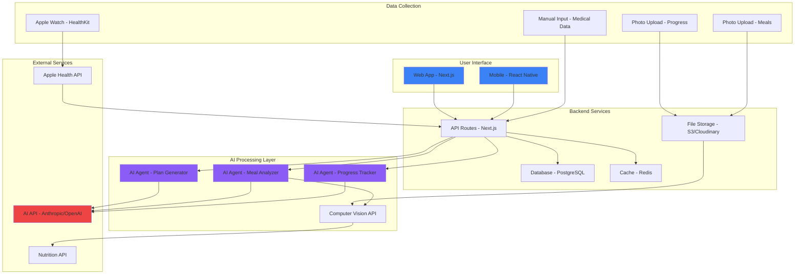

# AI Health Coach - Personalized Training & Longevity App

<div align="center">


**[🇪🇸 Español](#español) | [🇬🇧 English](#english) | [🚀 Live Demo](#) | [📖 Docs](./docs)**

*An AI-powered health application that creates personalized training and nutrition plans based on real medical data, helping you live to 120+ years with optimal quality of life.*

</div>

---

## 🎯 Vision

This project aims to revolutionize personalized health by combining:
- 🧬 **Real medical data** (glucose, cholesterol, blood tests)
- 🤖 **Advanced AI** for daily adaptive plans
- ⌚ **Wearable integration** (Apple Watch, health devices)
- 📸 **Computer vision** for progress tracking and meal analysis
- 📊 **Predictive analytics** for longevity optimization

**Goal**: Empower people to live 120+ years with sustained energy, vitality, and health.

---

## ✨ Key Features

### 🎨 MVP Landing Page (Current)
- ✅ Interactive app mockup demo
- ✅ Dynamic progress charts (daily/weekly/monthly)
- ✅ Lifespan quality projection visualization (up to 120+ years)
- ✅ Bilingual support (Spanish/English)
- ✅ Partner recruitment CTA
- ✅ Fully responsive design
- ✅ SEO optimized with Open Graph

### 🚀 Planned Features (Roadmap)
- ⏳ Functional onboarding questionnaire
- ⏳ AI integration for plan generation
- ⏳ Apple Watch HealthKit integration
- ⏳ Photo upload for progress tracking
- ⏳ Meal photo analysis with AI
- ⏳ Real-time dashboard
- ⏳ Social sharing capabilities
- ⏳ Scientific validation with health professionals

---

## 🏗️ Architecture



### Technical Stack

**Frontend**
- Next.js 14 (App Router)
- TypeScript
- Tailwind CSS
- Recharts for data visualization

**Backend (Planned)**
- Next.js API Routes
- PostgreSQL / Supabase
- Redis for caching
- AWS S3 / Cloudinary for image storage

**AI Integration (Planned)**
- Advanced AI API for plan generation
- Computer Vision for meal and progress photo analysis
- Natural Language Processing for user interactions

**Wearables (Planned)**
- Apple HealthKit SDK
- Real-time data synchronization
- Activity, heart rate, sleep tracking

**See [ARCHITECTURE.md](./docs/ARCHITECTURE.md) for detailed technical documentation**

---

## 🚀 Quick Start

### Prerequisites
- Node.js 18+
- npm or yarn
- Git

### Installation

```bash
# Clone the repository
git clone https://github.com/devjaime/app-entrenamiento-ia.git
cd app-entrenamiento-ia

# Install dependencies
npm install

# Run development server
npm run dev
```

Open [http://localhost:3000](http://localhost:3000) for Spanish version
Open [http://localhost:3000/en](http://localhost:3000/en) for English version

### Build for Production

```bash
npm run build
npm start
```

---

## 📁 Project Structure

```
app-entrenamiento-ia/
├── app/
│   ├── page.tsx              # Landing page (Spanish)
│   ├── layout.tsx            # Root layout with metadata
│   ├── globals.css           # Global styles
│   └── en/                   # English version
│       ├── page.tsx
│       ├── Hero.tsx
│       ├── Features.tsx
│       ├── CTA.tsx
│       ├── ProgressChart.tsx
│       └── LifespanChart.tsx
├── components/
│   └── landing/
│       ├── Hero.tsx          # Hero section
│       ├── Features.tsx      # Key features
│       ├── Demo.tsx          # Interactive app mockup
│       ├── ProgressChart.tsx # Progress visualization
│       ├── LifespanChart.tsx # Longevity projection
│       └── CTA.tsx           # Call to action
├── docs/
│   ├── ARCHITECTURE.md       # Technical architecture
│   ├── AGENTS.md            # AI agents documentation
│   └── SKILLS.md            # Agent skills and capabilities
├── public/
│   └── images/              # Static assets
├── netlify.toml             # Netlify configuration
└── README.md                # This file
```

---

## 🤖 AI Agents

This project uses specialized AI agents for different tasks:

- **Plan Generator Agent**: Creates personalized training and nutrition plans
- **Meal Analyzer Agent**: Analyzes food photos and suggests recipes
- **Progress Tracker Agent**: Monitors daily progress and adjusts plans
- **Longevity Optimizer Agent**: Long-term health recommendations

**See [AGENTS.md](./docs/AGENTS.md) for detailed agent documentation**

---

## 🛠️ Configuration

### 1. Contact Links

Contact information is already configured:

```typescript
LinkedIn: "https://www.linkedin.com/in/devjaime"
Email: "hernandez.hs@gmail.com"
Twitter/X: "https://x.com/HsJhernandez"
```

To update, edit `components/landing/CTA.tsx` and `app/en/CTA.tsx`.

### 2. Open Graph Image

Create a 1200x630px image and save as `/public/og-image.jpg`

Recommended tools:
- [Canva](https://www.canva.com/)
- [Figma](https://www.figma.com/)
- [OG Image Generator](https://og-image.vercel.app/)

### 3. Environment Variables

Copy `.env.example` to `.env.local`:

```bash
# AI API Configuration
AI_API_KEY=your_api_key_here

# App Configuration
NEXT_PUBLIC_APP_URL=https://your-domain.netlify.app
```

---

## 📊 Roadmap

### Phase 1: MVP Landing Page ✅ (Current)
- [x] Hero section with value proposition
- [x] Features showcase
- [x] Interactive demo mockup
- [x] Progress visualization charts
- [x] Lifespan projection graph
- [x] Partner recruitment CTA
- [x] Bilingual support (ES/EN)
- [x] SEO optimization

### Phase 2: Functional Onboarding ⏳ (Next)
- [ ] Multi-step questionnaire
- [ ] Medical data input
- [ ] Photo upload for body composition
- [ ] Goal setting
- [ ] LocalStorage persistence

### Phase 3: AI Integration ⏳
- [ ] AI API integration
- [ ] Plan generation engine
- [ ] Meal recommendation system
- [ ] Daily adjustment algorithm

### Phase 4: Wearables & Tracking ⏳
- [ ] Apple Watch HealthKit integration
- [ ] Real-time activity sync
- [ ] Photo-based progress tracking
- [ ] Meal photo analysis with computer vision

### Phase 5: Dashboard & Analytics ⏳
- [ ] User dashboard
- [ ] Progress tracking over time
- [ ] AI chat assistant
- [ ] Social sharing features

### Phase 6: Scientific Validation ⏳
- [ ] Partnership with health professionals
- [ ] Clinical studies
- [ ] Peer-reviewed research
- [ ] Medical advisory board

---

## 🤝 Contributing

This is a pilot project seeking partners and collaborators:

**We're looking for:**
- 💼 Co-founders with healthtech experience
- 🏥 Health professionals (nutritionists, doctors)
- 💻 Developers passionate about AI + health
- 💰 Investors focused on wellness & longevity

**See [CONTRIBUTING.md](./CONTRIBUTING.md) for contribution guidelines**

---

## 📄 License

MIT License - see [LICENSE](./LICENSE) for details

---

## ⚠️ Disclaimer

This is a pilot project in validation phase. Data and projections shown are simulations for illustrative purposes based on longevity research and healthy habits studies.

We are seeking partners, health professionals, developers, and investors to scientifically validate this project and build a product that truly improves people's health and life expectancy.

**Not medical advice.** Always consult with health professionals before making changes to your diet or exercise routine.

---

## 📞 Contact

- **LinkedIn**: [devjaime](https://www.linkedin.com/in/devjaime)
- **GitHub**: [@devjaime](https://github.com/devjaime)
- **Twitter/X**: [@HsJhernandez](https://x.com/HsJhernandez)
- **Email**: hernandez.hs@gmail.com

---

## 🌟 Support

If you find this project interesting, please:
- ⭐ Star this repository
- 🐦 Share on Twitter/LinkedIn
- 🤝 Connect for partnership opportunities

---

<div align="center">

# Español

</div>

## 🎯 Visión

Este proyecto busca revolucionar la salud personalizada combinando:
- 🧬 **Datos médicos reales** (glucosa, colesterol, exámenes de sangre)
- 🤖 **IA avanzada** para planes adaptativos diarios
- ⌚ **Integración con wearables** (Apple Watch, dispositivos de salud)
- 📸 **Visión por computadora** para tracking de progreso y análisis de comidas
- 📊 **Análisis predictivo** para optimización de longevidad

**Objetivo**: Empoderar a las personas para vivir 120+ años con energía, vitalidad y salud sostenidas.

## ✨ Características Principales

### 🎨 MVP Landing Page (Actual)
- ✅ Demo interactiva con mockup de la app
- ✅ Gráficos dinámicos de progreso (diario/semanal/mensual)
- ✅ Visualización de proyección de calidad de vida (hasta 120+ años)
- ✅ Soporte bilingüe (Español/Inglés)
- ✅ CTA para reclutamiento de socios
- ✅ Diseño totalmente responsive
- ✅ Optimizado para SEO con Open Graph

### 🚀 Funcionalidades Planeadas (Roadmap)
- ⏳ Cuestionario de onboarding funcional
- ⏳ Integración con IA para generación de planes
- ⏳ Integración Apple Watch HealthKit
- ⏳ Carga de fotos para tracking de progreso
- ⏳ Análisis de fotos de comidas con IA
- ⏳ Dashboard en tiempo real
- ⏳ Capacidades de compartir en redes sociales
- ⏳ Validación científica con profesionales de la salud

## 🚀 Inicio Rápido

### Prerequisitos
- Node.js 18+
- npm o yarn
- Git

### Instalación

```bash
# Clonar el repositorio
git clone https://github.com/devjaime/app-entrenamiento-ia.git
cd app-entrenamiento-ia

# Instalar dependencias
npm install

# Ejecutar servidor de desarrollo
npm run dev
```

Abre [http://localhost:3000](http://localhost:3000) para versión en español
Abre [http://localhost:3000/en](http://localhost:3000/en) para versión en inglés

## 🤖 Agentes IA

Este proyecto usa agentes IA especializados para diferentes tareas:

- **Agente Generador de Planes**: Crea planes personalizados de entrenamiento y nutrición
- **Agente Analizador de Comidas**: Analiza fotos de alimentos y sugiere recetas
- **Agente Rastreador de Progreso**: Monitorea progreso diario y ajusta planes
- **Agente Optimizador de Longevidad**: Recomendaciones de salud a largo plazo

**Ver [AGENTS.md](./docs/AGENTS.md) para documentación detallada de agentes**

## 🤝 Contribuir

Este es un proyecto piloto que busca socios y colaboradores:

**Buscamos:**
- 💼 Co-fundadores con experiencia en healthtech
- 🏥 Profesionales de la salud (nutricionistas, médicos)
- 💻 Desarrolladores apasionados por IA + salud
- 💰 Inversores enfocados en wellness y longevidad

## 📞 Contacto

- **LinkedIn**: [devjaime](https://www.linkedin.com/in/devjaime)
- **GitHub**: [@devjaime](https://github.com/devjaime)
- **Twitter/X**: [@HsJhernandez](https://x.com/HsJhernandez)
- **Email**: hernandez.hs@gmail.com

---

<div align="center">

**Built with ❤️ for human longevity and optimal health**

[⬆ Back to top](#ai-health-coach---personalized-training--longevity-app)

</div>
