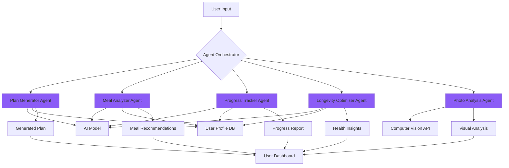
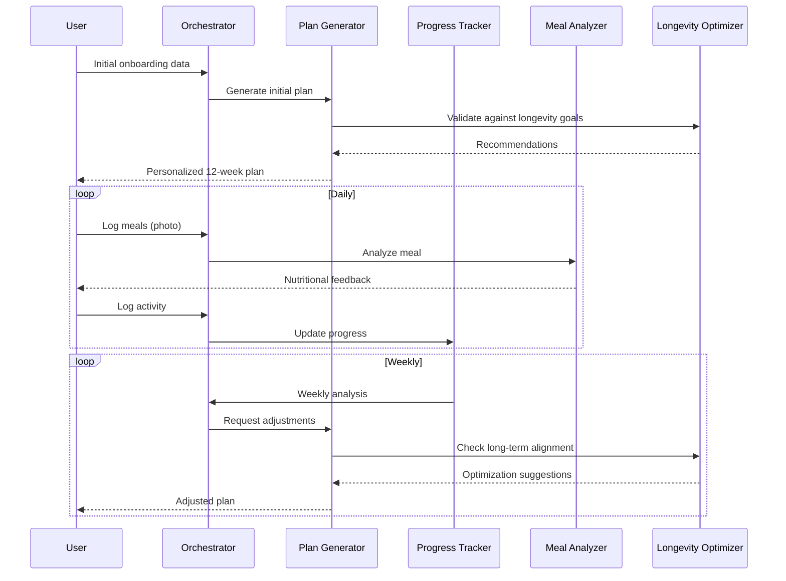

# AI Agents Documentation

## Overview

The AI Health Coach application uses a multi-agent architecture where specialized AI agents handle different aspects of health optimization. Each agent has specific responsibilities and collaborates with others to provide comprehensive, personalized health guidance.

## Agent Architecture



---

## 1. Plan Generator Agent

### Purpose
Creates initial personalized training and nutrition plans based on user's medical data, goals, and lifestyle.

### Inputs
- **Medical Data**: glucose, cholesterol, blood pressure, body fat percentage
- **Biometrics**: age, height, weight, BMI
- **Photos**: body composition images (front, side, back)
- **Goals**: longevity target, energy levels, performance objectives
- **Lifestyle**: work schedule, sleep patterns, stress levels
- **Restrictions**: allergies, dietary preferences, injuries

### Processing
1. **Risk Assessment**: Analyzes medical data for health risks
2. **Baseline Calculation**: Determines current fitness level and metabolic health
3. **Goal Mapping**: Aligns user goals with scientific health markers
4. **Plan Generation**: Creates week-by-week training and meal plans
5. **Safety Check**: Validates plan against medical contraindications

### Outputs
```typescript
interface GeneratedPlan {
  trainingPlan: {
    weeklySchedule: Exercise[];
    progression: ProgressionStrategy;
    restDays: number[];
  };
  nutritionPlan: {
    dailyCalories: number;
    macros: { protein: number; carbs: number; fats: number };
    mealTiming: MealSchedule[];
    supplements: Supplement[];
  };
  healthMetrics: {
    targetWeight: number;
    targetBodyFat: number;
    targetVO2Max: number;
  };
  timeline: {
    shortTerm: Goal[];  // 1-3 months
    mediumTerm: Goal[]; // 3-12 months
    longTerm: Goal[];   // 1+ years
  };
  warnings: string[];
}
```

### AI Prompt Template
```
You are an expert personal trainer and nutritionist with 20+ years of experience.

USER PROFILE:
Age: {age}
Weight: {weight} kg
Height: {height} cm
Body Fat: {bodyFat}%
Medical Data:
- Glucose: {glucose} mg/dL
- Cholesterol: {cholesterol} mg/dL
- Blood Pressure: {bp}

GOALS:
- Primary: {primaryGoal}
- Target Age: 120+ years with optimal health
- Energy Level Target: 9/10

Create a comprehensive 12-week plan including:
1. Weekly training schedule (exercises, sets, reps, intensity)
2. Daily nutrition plan (meals, macros, timing)
3. Recovery protocols
4. Progress milestones
5. Health optimization strategies

Format as structured JSON.
```

---

## 2. Meal Analyzer Agent

### Purpose
Analyzes food photos and available ingredients to suggest optimal meals that fit the user's plan.

### Inputs
- **Photo**: Image of food or available ingredients
- **Context**: Current nutrition targets for the day
- **Preferences**: User's taste preferences and restrictions
- **Time**: Time of day (breakfast, lunch, dinner, snack)

### Processing
1. **Image Recognition**: Identifies food items in photo using computer vision
2. **Nutritional Analysis**: Calculates macros and calories
3. **Plan Alignment**: Compares with daily nutrition targets
4. **Recipe Generation**: Suggests meals with available ingredients
5. **Optimization**: Adjusts portions to hit macro targets

### Outputs
```typescript
interface MealAnalysis {
  identifiedFoods: {
    name: string;
    quantity: string;
    confidence: number;
  }[];
  nutritionalBreakdown: {
    calories: number;
    protein: number;
    carbs: number;
    fats: number;
    fiber: number;
    micronutrients: Record<string, number>;
  };
  suggestions: {
    recipe: string;
    instructions: string[];
    timing: string;
    portionAdjustments: string;
    alignment: "perfect" | "good" | "needs adjustment";
  }[];
  alternatives: Meal[];
}
```

### AI Prompt Template
```
You are a nutrition expert analyzing a meal photo.

IDENTIFIED FOODS:
{foods}

USER'S DAILY TARGETS:
Calories: {targetCalories}
Protein: {targetProtein}g
Carbs: {targetCarbs}g
Fats: {targetFats}g

CURRENT INTAKE TODAY:
Calories: {currentCalories}
Protein: {currentProtein}g
Carbs: {currentCarbs}g
Fats: {currentFats}g

REMAINING FOR TODAY:
Calories: {remainingCalories}
Protein: {remainingProtein}g
Carbs: {remainingCarbs}g
Fats: {remainingFats}g

Provide:
1. Nutritional breakdown of the photo
2. Whether this meal fits the plan
3. Suggested recipes using these ingredients
4. Portion recommendations
5. Alternative meal ideas if this doesn't fit

Format as JSON.
```

---

## 3. Progress Tracker Agent

### Purpose
Monitors daily progress and adjusts the plan based on actual results and adherence.

### Inputs
- **Daily Logs**: steps, exercise completion, meals eaten
- **Biometrics**: weight, body measurements, photos
- **Wearable Data**: heart rate, sleep quality, activity levels
- **User Feedback**: energy levels, mood, stress, soreness
- **Current Plan**: active training and nutrition plan

### Processing
1. **Data Aggregation**: Combines all input sources
2. **Trend Analysis**: Identifies patterns over time
3. **Adherence Calculation**: Measures plan compliance
4. **Result Evaluation**: Compares actual vs. expected progress
5. **Adjustment Recommendation**: Suggests plan modifications

### Outputs
```typescript
interface ProgressReport {
  summary: {
    weekNumber: number;
    adherence: number; // 0-100%
    overallTrend: "improving" | "stable" | "declining";
  };
  metrics: {
    weight: { current: number; change: number; target: number };
    bodyFat: { current: number; change: number; target: number };
    energy: { average: number; trend: string };
    strength: { improvements: string[]; }
  };
  achievements: Achievement[];
  challenges: Challenge[];
  recommendations: {
    trainingAdjustments: string[];
    nutritionAdjustments: string[];
    recoveryTips: string[];
    motivationalInsights: string[];
  };
  nextWeekPlan: {
    modifications: Modification[];
    focusAreas: string[];
  };
}
```

### AI Prompt Template
```
You are analyzing a user's weekly health progress.

WEEK {weekNumber} DATA:
Training:
- Completed: {completedWorkouts}/{plannedWorkouts} workouts
- Average intensity: {avgIntensity}/10
- Total active minutes: {activeMinutes}

Nutrition:
- Adherence: {nutritionAdherence}%
- Average calories: {avgCalories}
- Average protein: {avgProtein}g

Biometrics:
- Weight change: {weightChange} kg
- Body fat change: {bodyFatChange}%

Wellbeing:
- Average energy: {avgEnergy}/10
- Average sleep: {avgSleep} hours
- Stress level: {avgStress}/10

CURRENT PLAN TARGETS:
- Weight goal: {weightGoal} kg
- Weekly calorie deficit: {calDeficit}
- Training frequency: {frequency}x/week

Analyze:
1. Progress toward goals
2. Plan adherence and challenges
3. What's working well
4. Recommended adjustments
5. Motivation and encouragement

Format as JSON.
```

---

## 4. Longevity Optimizer Agent

### Purpose
Provides long-term health recommendations focused on maximizing lifespan and healthspan.

### Inputs
- **Complete Health Profile**: all medical data, genetics (if available)
- **Lifestyle Factors**: stress, sleep, environment, social connections
- **Aging Markers**: biological age indicators
- **Historical Data**: long-term trends
- **Scientific Research**: latest longevity studies

### Processing
1. **Risk Profiling**: Identifies age-related health risks
2. **Biomarker Analysis**: Evaluates aging indicators
3. **Literature Review**: Incorporates latest longevity research
4. **Intervention Mapping**: Suggests evidence-based interventions
5. **Timeline Projection**: Estimates health trajectory

### Outputs
```typescript
interface LongevityInsights {
  currentBiologicalAge: number;
  projectedLifespan: {
    withCurrentHabits: number;
    withOptimizedHabits: number;
    qualityOfLifeCurve: DataPoint[];
  };
  riskFactors: {
    category: string;
    currentRisk: "low" | "medium" | "high";
    modifiable: boolean;
    interventions: Intervention[];
  }[];
  recommendations: {
    priority: "critical" | "high" | "medium" | "low";
    category: "nutrition" | "exercise" | "sleep" | "stress" | "supplements";
    action: string;
    evidence: string;
    expectedImpact: string;
  }[];
  milestones: {
    age: number;
    healthGoals: string[];
    preventiveMeasures: string[];
  }[];
}
```

### AI Prompt Template
```
You are a longevity expert and gerontologist.

USER PROFILE:
Current age: {age}
Medical history: {medicalHistory}
Current biomarkers: {biomarkers}
Lifestyle: {lifestyle}

GOAL: Live to 120+ years with optimal quality of life

Based on latest longevity research, provide:
1. Biological age estimate
2. Major health risks for longevity
3. Evidence-based interventions (prioritized)
4. Decade-by-decade health strategy
5. Quality of life optimization tactics
6. Preventive measures for common age-related diseases

Reference specific studies where possible.
Format as JSON.
```

---

## 5. Photo Analysis Agent

### Purpose
Analyzes progress photos to track visual changes in body composition and provides objective feedback.

### Inputs
- **Progress Photos**: front, side, back views
- **Timestamp**: when photo was taken
- **Baseline Photos**: initial photos for comparison
- **User Goals**: target body composition

### Processing
1. **Body Segmentation**: Identifies body parts and posture
2. **Composition Analysis**: Estimates muscle mass and fat distribution
3. **Change Detection**: Compares with previous photos
4. **Progress Quantification**: Assigns objective metrics
5. **Feedback Generation**: Creates motivational insights

### Outputs
```typescript
interface PhotoAnalysis {
  composition: {
    estimatedBodyFat: number;
    muscleDefinition: "low" | "moderate" | "high" | "excellent";
    posture: "good" | "needs improvement";
    symmetry: number; // 0-100%
  };
  comparison: {
    timeSinceBaseline: number; // days
    visibleChanges: string[];
    improvements: string[];
    areasToFocus: string[];
  };
  measurements: {
    shoulderWidth: number;
    waistCircumference: number;
    chestDepth: number;
    // etc.
  };
  motivation: {
    progress: "excellent" | "good" | "steady" | "slow";
    encouragement: string;
    nextMilestone: string;
  };
}
```

---

## Agent Collaboration

Agents work together to provide comprehensive health coaching:



---

## Implementation Status

### Current (MVP)
- ❌ Agents not yet implemented (mockup data only)
- ✅ UI/UX designed for agent interactions
- ✅ Data models defined
- ✅ Agent architecture planned

### Next Steps
1. Implement Agent Orchestrator
2. Integrate AI API (Anthropic/OpenAI)
3. Build Plan Generator Agent
4. Add Meal Analyzer with computer vision
5. Implement Progress Tracker
6. Deploy Longevity Optimizer
7. Add Photo Analysis Agent

---

## Technical Requirements

### AI Model Requirements
- **Language Model**: GPT-4 or Claude 3.5+
- **Vision Model**: GPT-4V or Claude 3+ with vision
- **Specialized**: Nutrition API for food database

### Compute Resources
- Real-time inference for chat interactions
- Batch processing for plan generation
- GPU for photo analysis

### Data Storage
- User profiles and health data
- Historical logs for trend analysis
- Generated plans and recommendations
- Photos (encrypted)

---

## Privacy & Security

- All health data encrypted at rest and in transit
- HIPAA-compliant data handling
- User data never used for model training
- Photo analysis performed server-side only
- Data deletion on user request

---

## References

- [AI Agent Design Patterns](https://www.anthropic.com/research)
- [Health Data Privacy Best Practices](https://www.hhs.gov/hipaa)
- [Longevity Research Database](https://www.longevity.technology/)

---

*Last updated: January 2026*
