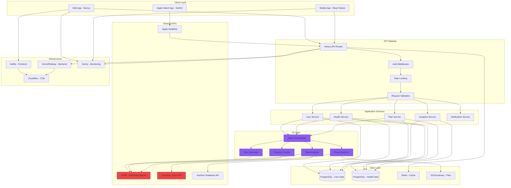
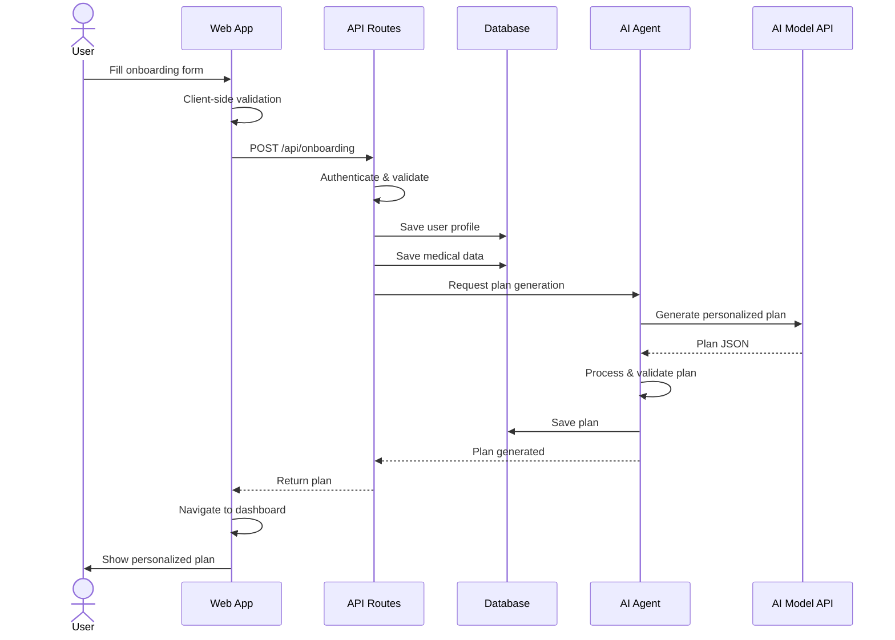
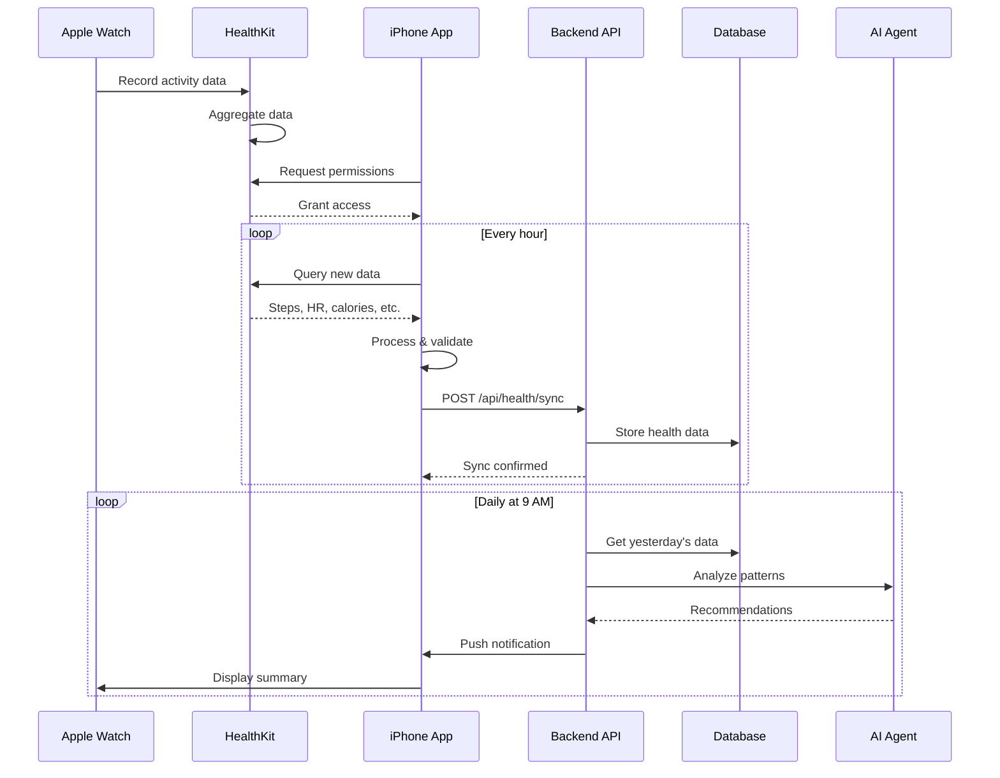
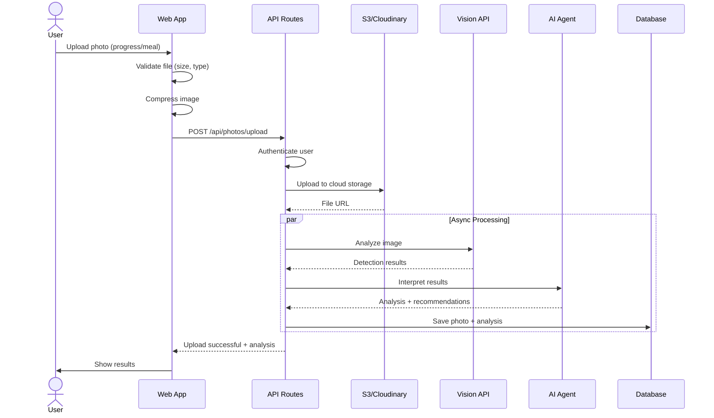
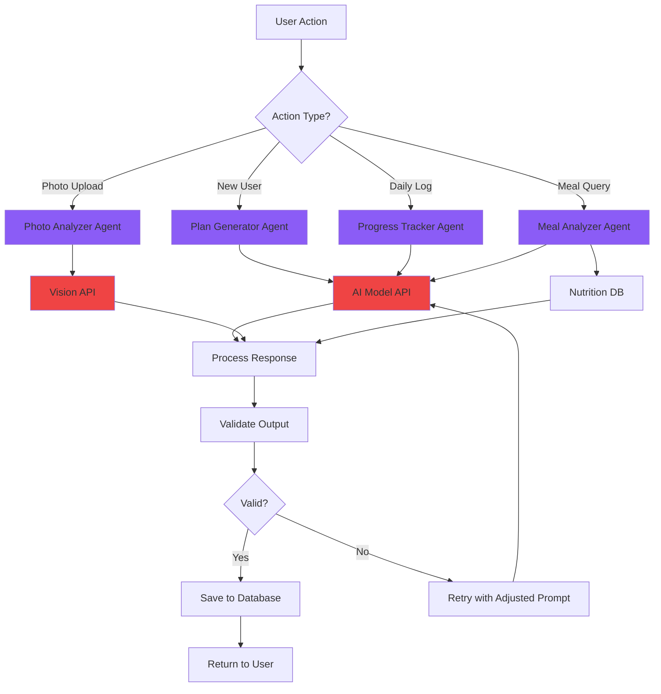
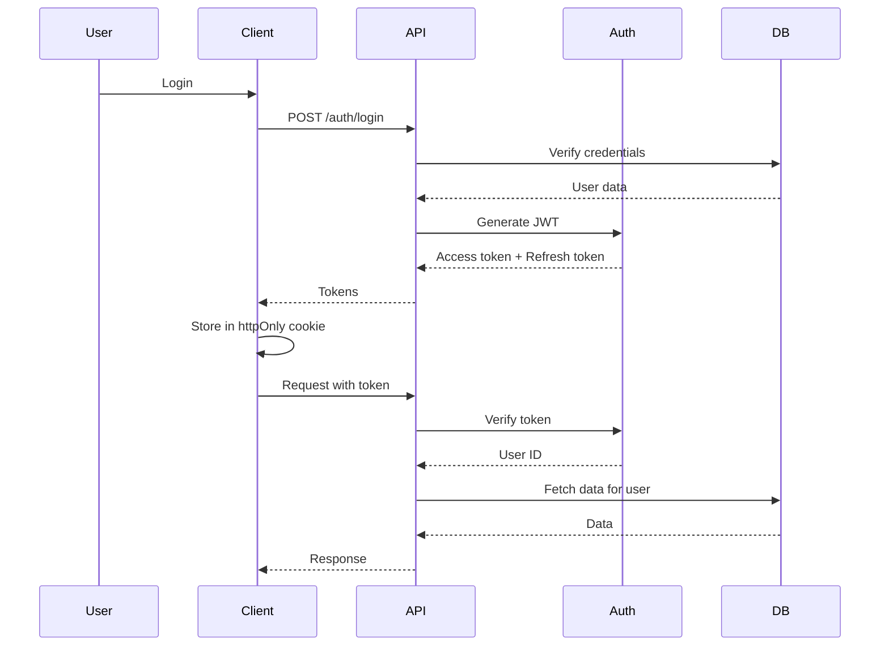

# Technical Architecture

## Overview

The AI Health Coach is built as a modern, scalable web application with a microservices-inspired architecture. This document details the technical implementation, data flows, and integration points.

---

## System Architecture



---

## Technology Stack

### Frontend

**Web Application**
```typescript
// Tech Stack
- Framework: Next.js 14 (App Router)
- Language: TypeScript 5.3
- Styling: Tailwind CSS 3.4
- UI Components: Shadcn/ui
- Charts: Recharts
- State Management: React Context + Zustand
- Forms: React Hook Form + Zod validation
- Image Handling: Next/Image
```

**Mobile Application** (Planned)
```typescript
- Framework: React Native with Expo
- Navigation: React Navigation
- State: Redux Toolkit
- API: React Query
- Local Storage: AsyncStorage + SQLite
```

**Apple Watch App** (Planned)
```swift
// Native SwiftUI app
- Language: Swift 5.9
- Framework: SwiftUI + HealthKit
- Data Sync: Background URLSession
- Local Storage: CoreData
```

### Backend

**API Layer**
```typescript
// Next.js API Routes
export async function POST(request: Request) {
  // Request validation
  const body = await request.json();
  const validated = schema.parse(body);

  // Auth check
  const user = await authenticate(request);

  // Business logic
  const result = await processData(validated, user);

  // Response
  return NextResponse.json(result);
}
```

**Database Schema**
```sql
-- Users Table
CREATE TABLE users (
  id UUID PRIMARY KEY DEFAULT gen_random_uuid(),
  email VARCHAR(255) UNIQUE NOT NULL,
  name VARCHAR(255),
  created_at TIMESTAMP DEFAULT NOW(),
  updated_at TIMESTAMP DEFAULT NOW()
);

-- Health Profiles Table
CREATE TABLE health_profiles (
  id UUID PRIMARY KEY DEFAULT gen_random_uuid(),
  user_id UUID REFERENCES users(id) ON DELETE CASCADE,
  age INTEGER,
  height DECIMAL(5,2),
  weight DECIMAL(5,2),
  body_fat_percentage DECIMAL(4,2),
  created_at TIMESTAMP DEFAULT NOW(),
  updated_at TIMESTAMP DEFAULT NOW()
);

-- Medical Data Table
CREATE TABLE medical_data (
  id UUID PRIMARY KEY DEFAULT gen_random_uuid(),
  user_id UUID REFERENCES users(id) ON DELETE CASCADE,
  glucose DECIMAL(5,1),
  cholesterol_total DECIMAL(5,1),
  cholesterol_hdl DECIMAL(5,1),
  cholesterol_ldl DECIMAL(5,1),
  blood_pressure_systolic INTEGER,
  blood_pressure_diastolic INTEGER,
  recorded_at TIMESTAMP DEFAULT NOW()
);

-- Plans Table
CREATE TABLE plans (
  id UUID PRIMARY KEY DEFAULT gen_random_uuid(),
  user_id UUID REFERENCES users(id) ON DELETE CASCADE,
  plan_data JSONB NOT NULL,
  start_date DATE,
  end_date DATE,
  status VARCHAR(50),
  created_at TIMESTAMP DEFAULT NOW()
);

-- Daily Logs Table
CREATE TABLE daily_logs (
  id UUID PRIMARY KEY DEFAULT gen_random_uuid(),
  user_id UUID REFERENCES users(id) ON DELETE CASCADE,
  log_date DATE NOT NULL,
  steps INTEGER,
  calories INTEGER,
  workouts_completed JSONB,
  meals JSONB,
  energy_level INTEGER,
  sleep_hours DECIMAL(3,1),
  notes TEXT,
  created_at TIMESTAMP DEFAULT NOW()
);

-- Photos Table
CREATE TABLE photos (
  id UUID PRIMARY KEY DEFAULT gen_random_uuid(),
  user_id UUID REFERENCES users(id) ON DELETE CASCADE,
  photo_type VARCHAR(50), -- 'progress', 'meal'
  file_url TEXT NOT NULL,
  analysis_data JSONB,
  taken_at TIMESTAMP DEFAULT NOW(),
  created_at TIMESTAMP DEFAULT NOW()
);
```

---

## Data Flow Diagrams

### 1. User Onboarding Flow



### 2. Apple Watch Integration Flow



**HealthKit Implementation**:
```swift
import HealthKit

class HealthKitManager {
    let healthStore = HKHealthStore()

    // Request permissions
    func requestAuthorization() async throws {
        let typesToRead: Set<HKObjectType> = [
            HKQuantityType(.stepCount),
            HKQuantityType(.activeEnergyBurned),
            HKQuantityType(.heartRate),
            HKQuantityType(.distanceWalkingRunning),
            HKCategoryType(.sleepAnalysis)
        ]

        try await healthStore.requestAuthorization(
            toShare: [],
            read: typesToRead
        )
    }

    // Query steps for today
    func getStepsToday() async throws -> Double {
        let stepType = HKQuantityType(.stepCount)
        let now = Date()
        let startOfDay = Calendar.current.startOfDay(for: now)

        let predicate = HKQuery.predicateForSamples(
            withStart: startOfDay,
            end: now
        )

        let query = HKStatisticsQuery(
            quantityType: stepType,
            quantitySamplePredicate: predicate,
            options: .cumulativeSum
        ) { _, result, error in
            guard let result = result,
                  let sum = result.sumQuantity() else {
                return
            }
            let steps = sum.doubleValue(
                for: HKUnit.count()
            )
            // Send to backend
            self.syncToBackend(steps: steps)
        }

        healthStore.execute(query)
    }

    func syncToBackend(steps: Double) {
        let url = URL(string: "\(API_BASE)/health/sync")!
        var request = URLRequest(url: url)
        request.httpMethod = "POST"
        request.setValue("Bearer \(authToken)",
                        forHTTPHeaderField: "Authorization")

        let body: [String: Any] = [
            "type": "steps",
            "value": steps,
            "timestamp": ISO8601DateFormatter()
                .string(from: Date())
        ]

        request.httpBody = try? JSONSerialization
            .data(withJSONObject: body)

        URLSession.shared.dataTask(with: request)
            .resume()
    }
}
```

### 3. Photo Upload & Analysis Flow



**Photo Upload Implementation**:
```typescript
// API Route: /api/photos/upload
export async function POST(request: Request) {
  const user = await authenticate(request);
  const formData = await request.formData();
  const file = formData.get('photo') as File;
  const type = formData.get('type') as 'progress' | 'meal';

  // Validate
  if (!file || file.size > 10_000_000) {
    return NextResponse.json(
      { error: 'Invalid file' },
      { status: 400 }
    );
  }

  // Upload to storage
  const fileUrl = await uploadToCloudinary(file);

  // Trigger async analysis
  const jobId = await queuePhotoAnalysis({
    userId: user.id,
    photoUrl: fileUrl,
    photoType: type
  });

  // Save to DB
  const photo = await db.photos.create({
    data: {
      userId: user.id,
      photoType: type,
      fileUrl,
      analysisJobId: jobId
    }
  });

  return NextResponse.json({
    photoId: photo.id,
    analysisJobId: jobId,
    status: 'processing'
  });
}
```

**Vision Analysis Worker**:
```typescript
async function analyzePhoto(job: AnalysisJob) {
  const { photoUrl, photoType } = job;

  if (photoType === 'meal') {
    // Food detection
    const detection = await visionAPI.detectFood(photoUrl);

    // Extract foods
    const foods = detection.objects.map(obj => ({
      name: obj.label,
      confidence: obj.confidence,
      boundingBox: obj.box
    }));

    // Get nutrition data
    const nutrition = await nutritionAPI.lookup(
      foods.map(f => f.name)
    );

    // AI analysis
    const analysis = await aiAgent.analyzeMeal({
      foods,
      nutrition,
      userPlan: await getUserPlan(job.userId)
    });

    // Save results
    await db.photos.update({
      where: { id: job.photoId },
      data: { analysisData: analysis }
    });

  } else if (photoType === 'progress') {
    // Body composition analysis
    const bodyAnalysis = await visionAPI.analyzeBody(
      photoUrl
    );

    // Compare with previous photos
    const previousPhotos = await getPreviousPhotos(
      job.userId
    );
    const comparison = compareProgress(
      bodyAnalysis,
      previousPhotos
    );

    // AI insights
    const insights = await aiAgent.generateProgressInsights({
      current: bodyAnalysis,
      comparison,
      userGoals: await getUserGoals(job.userId)
    });

    // Save results
    await db.photos.update({
      where: { id: job.photoId },
      data: { analysisData: { bodyAnalysis, comparison, insights } }
    });
  }
}
```

### 4. AI Agent Processing Flow



---

## API Endpoints

### Authentication
```
POST   /api/auth/signup           - Create new account
POST   /api/auth/login            - Login
POST   /api/auth/logout           - Logout
GET    /api/auth/me               - Get current user
```

### Onboarding
```
POST   /api/onboarding/profile    - Save user profile
POST   /api/onboarding/medical    - Save medical data
POST   /api/onboarding/photos     - Upload body photos
POST   /api/onboarding/generate   - Generate initial plan
```

### Plans
```
GET    /api/plans/current         - Get active plan
GET    /api/plans/:id             - Get specific plan
POST   /api/plans/adjust          - Request plan adjustment
GET    /api/plans/:id/progress    - Get plan progress
```

### Daily Tracking
```
POST   /api/logs/daily            - Create daily log
GET    /api/logs/daily/:date      - Get log for date
PUT    /api/logs/daily/:id        - Update daily log
GET    /api/logs/weekly           - Get weekly summary
GET    /api/logs/monthly          - Get monthly summary
```

### Photos
```
POST   /api/photos/upload         - Upload photo
GET    /api/photos                - List user photos
GET    /api/photos/:id            - Get photo details
GET    /api/photos/:id/analysis   - Get analysis results
DELETE /api/photos/:id            - Delete photo
```

### Health Data
```
POST   /api/health/sync           - Sync from wearable
GET    /api/health/latest         - Get latest metrics
GET    /api/health/history        - Get historical data
GET    /api/health/insights       - Get AI insights
```

### AI Interactions
```
POST   /api/ai/chat               - Chat with AI assistant
POST   /api/ai/meal-suggestions   - Get meal suggestions
POST   /api/ai/recipe             - Generate recipe
POST   /api/ai/motivation         - Get motivational message
```

---

## Security Architecture

### Authentication & Authorization


### Data Encryption
- **In Transit**: TLS 1.3
- **At Rest**: AES-256
- **Passwords**: Argon2id
- **Tokens**: JWT with RS256

### Privacy Measures
- HIPAA compliance ready
- GDPR compliant data handling
- Data anonymization for analytics
- User data export capability
- Right to be forgotten implementation

---

## Performance Optimization

### Caching Strategy
```typescript
// Redis caching layers
const CACHE_KEYS = {
  USER_PROFILE: (userId) => `user:${userId}:profile`,
  ACTIVE_PLAN: (userId) => `user:${userId}:plan:active`,
  DAILY_LOG: (userId, date) => `user:${userId}:log:${date}`,
  HEALTH_SUMMARY: (userId) => `user:${userId}:health:summary`,
};

// Cache durations
const CACHE_TTL = {
  USER_PROFILE: 3600,      // 1 hour
  ACTIVE_PLAN: 1800,       // 30 minutes
  DAILY_LOG: 600,          // 10 minutes
  HEALTH_SUMMARY: 300,     // 5 minutes
};
```

### Database Optimization
- Indexed columns: user_id, created_at, log_date
- Partitioning: daily_logs by date range
- Read replicas for analytics queries
- Connection pooling

### CDN & Asset Optimization
- Static assets via Cloudflare CDN
- Image optimization with Next/Image
- Code splitting and lazy loading
- Brotli compression

---

## Monitoring & Observability

### Metrics Tracked
- API response times
- Error rates
- AI API latency
- Database query performance
- User engagement metrics
- Photo processing times

### Tools
- **APM**: Sentry
- **Logs**: CloudWatch / Better Stack
- **Uptime**: UptimeRobot
- **Analytics**: Posthog / Mixpanel

---

## Deployment Architecture

### Production Environment
```
Web App:     Netlify (Edge Functions)
API/Backend: Railway / Render
Database:    Supabase / Railway
Storage:     Cloudinary / AWS S3
Cache:       Upstash Redis
CDN:         Cloudflare
```

### CI/CD Pipeline
```yaml
# .github/workflows/deploy.yml
name: Deploy
on:
  push:
    branches: [main]

jobs:
  test:
    runs-on: ubuntu-latest
    steps:
      - uses: actions/checkout@v3
      - run: npm install
      - run: npm test
      - run: npm run lint
      - run: npm run type-check

  deploy:
    needs: test
    runs-on: ubuntu-latest
    steps:
      - uses: actions/checkout@v3
      - run: npm install
      - run: npm run build
      - uses: netlify/actions/cli@master
        with:
          args: deploy --prod
```

---

## Scalability Considerations

### Horizontal Scaling
- Stateless API design
- Load balancing
- Database read replicas
- Distributed caching

### Vertical Scaling
- Resource optimization
- Query optimization
- Efficient data structures
- Lazy loading

### Future Scaling Needs
- Microservices migration
- Event-driven architecture
- Message queues (RabbitMQ/Kafka)
- Serverless functions

---

## Development Workflow

### Local Development
```bash
# Setup
npm install
cp .env.example .env.local

# Add your API keys to .env.local
# AI_API_KEY=your_key_here

# Run dev server
npm run dev

# Run tests
npm test

# Type checking
npm run type-check

# Lint
npm run lint
```

### Git Workflow
```
main          - Production
├── develop   - Development
├── feature/* - New features
└── hotfix/*  - Critical fixes
```

---

## Future Enhancements

### Phase 2
- WebSocket for real-time updates
- GraphQL API option
- Mobile app release
- Offline-first capability

### Phase 3
- ML model fine-tuning
- Custom AI models
- Advanced analytics dashboard
- Multi-language support

### Phase 4
- Enterprise features
- White-label solution
- Healthcare provider portal
- Research data platform

---

*For agent details, see [AGENTS.md](./AGENTS.md)*
*For capabilities, see [SKILLS.md](./SKILLS.md)*

---

*Last updated: January 2026*
