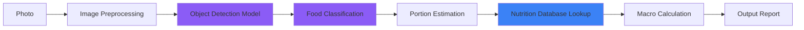
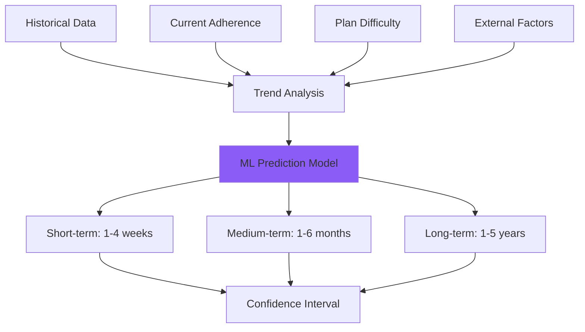

# AI Skills & Capabilities

## Overview

This document outlines the specific skills and capabilities that the AI Health Coach system provides through its various agents and integrations.

---

## Core Skills

### 1. Medical Data Analysis

**Capability**: Interpret medical biomarkers and identify health risks

**Skills Include**:
- Blood test analysis (glucose, cholesterol, HbA1c, etc.)
- Cardiovascular risk assessment
- Metabolic health evaluation
- Hormonal balance interpretation
- Inflammation marker analysis
- Nutritional deficiency detection

**Input Data**:
```typescript
interface MedicalData {
  bloodwork: {
    glucose: number;          // mg/dL
    hba1c: number;           // %
    cholesterol: {
      total: number;         // mg/dL
      hdl: number;
      ldl: number;
      triglycerides: number;
    };
    inflammation: {
      crp: number;           // mg/L
      esr: number;           // mm/hr
    };
    vitamins: {
      vitaminD: number;      // ng/mL
      vitaminB12: number;    // pg/mL
      folate: number;        // ng/mL
    };
  };
  vitals: {
    bloodPressure: { systolic: number; diastolic: number };
    restingHeartRate: number;
    bodyTemperature: number;
  };
}
```

**Output**: Risk assessment, recommendations, red flags

---

### 2. Personalized Plan Generation

**Capability**: Create custom training and nutrition plans based on individual profile

**Skills Include**:
- Exercise prescription (type, intensity, duration, frequency)
- Periodization planning (progressive overload)
- Nutrition calculation (TDEE, macros, meal timing)
- Supplement recommendations
- Recovery protocol design
- Adaptive planning based on feedback

**Factors Considered**:
- Age and biological sex
- Current fitness level
- Medical contraindications
- Available equipment
- Time constraints
- Dietary preferences
- Cultural food preferences
- Budget

**Output**: 12-week structured plan with daily specifics

---

### 3. Computer Vision - Food Recognition

**Capability**: Identify foods and estimate nutritional content from photos

**Skills Include**:
- Multi-food detection in single image
- Portion size estimation
- Nutritional breakdown calculation
- Recipe recognition
- Ingredient identification
- Quality assessment (freshness, preparation method)

**Technology**:


**Accuracy Targets**:
- Food identification: 90%+
- Portion estimation: ±20%
- Macro calculation: ±15%

---

### 4. Computer Vision - Progress Tracking

**Capability**: Analyze body composition changes from photos

**Skills Include**:
- Body fat percentage estimation
- Muscle definition assessment
- Posture analysis
- Symmetry evaluation
- Change detection over time
- Progress visualization

**Analysis Points**:
- Shoulder width
- Waist circumference
- Hip measurements
- Chest depth
- Arm and leg proportions
- Muscle definition (abs, arms, legs)

**Privacy**: All analysis done server-side, encrypted storage

---

### 5. Natural Language Interaction

**Capability**: Understand and respond to user questions in natural language

**Skills Include**:
- Conversational health coaching
- Exercise technique explanations
- Recipe suggestions based on preferences
- Motivation and encouragement
- Troubleshooting challenges
- Educational content delivery

**Sample Interactions**:

```
User: "I'm too tired to work out today"
AI: "I understand. Let's assess: On a scale of 1-10, how tired are you?
    If it's physical fatigue (7+), we can do a lighter mobility session.
    If it's mental fatigue, a quick 15-minute workout often actually
    increases energy. What sounds better?"

User: "What can I make with chicken, rice, and broccoli?"
AI: "Great ingredients! Here are 3 options that fit your macros:
    1. Chicken stir-fry (300 cal, 35g protein)
    2. Meal prep bowls (280 cal, 38g protein)
    3. One-pan baked dish (320 cal, 36g protein)
    Which sounds appealing?"

User: "Why is protein important?"
AI: "Protein serves 3 critical functions for your goals:
    1. Muscle repair & growth (especially important at your age)
    2. Satiety - keeps you full longer
    3. Metabolic boost - higher thermic effect than carbs/fats

    Your target of 120g daily supports both muscle maintenance and your
    longevity goals. Want to know the best sources?"
```

---

### 6. Wearable Data Integration

**Capability**: Process and interpret data from Apple Watch and other devices

**Skills Include**:
- Activity tracking (steps, active minutes, calories)
- Heart rate analysis (resting, active, HRV)
- Sleep tracking and quality assessment
- Recovery score calculation
- Training load monitoring
- Overtraining detection

**Data Sources**:
```typescript
interface WearableData {
  activity: {
    steps: number;
    activeMinutes: number;
    caloriesBurned: number;
    standHours: number;
  };
  heartRate: {
    resting: number;
    average: number;
    max: number;
    hrv: number;  // Heart Rate Variability
  };
  sleep: {
    totalHours: number;
    deepSleep: number;
    remSleep: number;
    sleepScore: number;
  };
  workouts: {
    type: string;
    duration: number;
    avgHeartRate: number;
    caloriesBurned: number;
  }[];
}
```

**Insights Generated**:
- Training readiness score
- Recovery recommendations
- Sleep optimization tips
- Activity suggestions

---

### 7. Progress Prediction

**Capability**: Forecast future results based on current trends

**Skills Include**:
- Weight trajectory modeling
- Body composition prediction
- Performance improvement estimation
- Longevity projection
- Adherence likelihood analysis
- Plateau prediction and prevention

**Prediction Models**:


**Accuracy Metrics**:
- Short-term: 85% within ±5%
- Medium-term: 75% within ±10%
- Long-term: 60% within ±20%

---

### 8. Adaptive Learning

**Capability**: Learn from user behavior and outcomes to improve recommendations

**Skills Include**:
- Response pattern recognition
- Preference learning
- Optimal timing discovery
- Communication style adaptation
- Plan difficulty calibration
- Success factor identification

**Learning Loops**:
1. **Fast Loop** (daily): Meal suggestions, exercise intensity
2. **Medium Loop** (weekly): Plan adjustments, communication tone
3. **Slow Loop** (monthly): Long-term strategy, goal refinement

---

### 9. Social & Motivational Features

**Capability**: Keep users engaged and motivated over time

**Skills Include**:
- Progress celebration and reinforcement
- Challenge recovery strategies
- Social comparison (anonymous)
- Achievement systems
- Habit formation techniques
- Motivational interviewing

**Psychological Techniques**:
- Goal-setting frameworks (SMART goals)
- Implementation intentions
- Identity-based habits
- Social proof
- Loss aversion
- Commitment devices

---

### 10. Scientific Knowledge Integration

**Capability**: Stay updated with latest health and longevity research

**Skills Include**:
- Literature review synthesis
- Evidence grading
- Conflicting study analysis
- Personalized research application
- Clinical guideline adherence
- Emerging therapy evaluation

**Knowledge Sources**:
- PubMed / medical journals
- Clinical guidelines (AHA, ADA, etc.)
- Longevity research databases
- Nutritional science updates
- Exercise physiology studies

**Update Frequency**: Monthly literature reviews, weekly trending topics

---

## Advanced Skills (Future)

### Genetic Analysis Integration
- DNA test interpretation (23andMe, etc.)
- Nutrigenomics recommendations
- Exercise response prediction
- Disease risk assessment

### Microbiome Analysis
- Gut health assessment
- Probiotic recommendations
- Dietary fiber optimization
- Inflammation management

### Biomarker Optimization
- Continuous glucose monitoring (CGM) integration
- Real-time metabolic feedback
- Meal timing optimization
- Glycemic response personalization

### Mental Health Integration
- Stress pattern recognition
- Meditation recommendations
- Cognitive performance tracking
- Mental energy optimization

---

## Skill Maturity Model

| Skill | Status | Accuracy | Roadmap |
|-------|--------|----------|---------|
| Medical Data Analysis | 🟡 Planned | Target: 95% | Q2 2026 |
| Plan Generation | 🟡 Planned | Target: 90% | Q2 2026 |
| Food Recognition | 🟡 Planned | Target: 90% | Q3 2026 |
| Progress Photos | 🟡 Planned | Target: 85% | Q3 2026 |
| NL Conversation | 🟡 Planned | Target: 95% | Q2 2026 |
| Wearable Integration | 🟡 Planned | Target: 98% | Q4 2026 |
| Progress Prediction | 🟡 Planned | Target: 80% | Q4 2026 |
| Adaptive Learning | 🔴 Research | Target: 75% | 2027 |
| Social Features | 🔴 Research | Target: N/A | 2027 |
| Scientific Updates | 🟡 Planned | Target: 90% | Q3 2026 |

Legend:
- 🟢 Implemented
- 🟡 Planned
- 🔴 Research Phase

---

## Skill Combinations

Skills become more powerful when combined:

### Example 1: Intelligent Meal Planning
```
Medical Data Analysis + Food Recognition + Plan Generation
→ "Your cholesterol is slightly elevated. This meal is higher in
   saturated fat than ideal. Try swapping the beef for salmon,
   which provides omega-3s that can help lower LDL."
```

### Example 2: Proactive Recovery
```
Wearable Data + Progress Tracking + Adaptive Learning
→ "Your HRV has been declining for 3 days and you've reported low
   energy. Your body needs recovery. I'm adjusting today's workout
   to a light yoga session instead of strength training."
```

### Example 3: Longevity Optimization
```
Medical Data + Progress Prediction + Scientific Knowledge
→ "Based on your biomarkers and current trajectory, implementing
   time-restricted eating (16:8) could improve your insulin sensitivity
   by ~15-20% within 8 weeks. Recent studies show this intervention is
   particularly effective for your age group."
```

---

## Skill Limitations

### Current Limitations
- Cannot diagnose medical conditions
- Cannot prescribe medications
- Cannot replace doctor consultations
- Photo analysis has ±20% margin of error
- Predictions less accurate for unique individuals
- Limited to data provided by user

### Ethical Boundaries
- Will not encourage unsafe weight loss
- Will not recommend extreme interventions
- Will not contradict medical advice
- Will not make definitive medical claims
- Will encourage professional consultation when needed

---

## Performance Metrics

### User-Facing Metrics
- Response accuracy: Target 90%+
- Response time: <3 seconds
- User satisfaction: Target 4.5/5
- Plan adherence rate: Target 75%+
- Results achievement: Target 80%+

### Technical Metrics
- API uptime: 99.9%
- Photo processing time: <5 seconds
- Database query time: <100ms
- Prediction accuracy: 75-85%
- Model inference time: <2 seconds

---

## Skill Development Roadmap

**Q2 2026**: Core Skills
- Basic plan generation
- Medical data interpretation
- NL conversation
- Web/mobile apps

**Q3 2026**: Visual AI
- Food photo recognition
- Progress photo analysis
- Portion estimation
- Recipe generation

**Q4 2026**: Advanced Analytics
- Wearable integration
- Predictive modeling
- Trend analysis
- Social features

**2027+**: Cutting Edge
- Genetic integration
- Microbiome analysis
- Continuous monitoring
- Research partnerships

---

*For implementation details, see [AGENTS.md](./AGENTS.md)*
*For architecture details, see [ARCHITECTURE.md](./ARCHITECTURE.md)*

---

*Last updated: January 2026*
